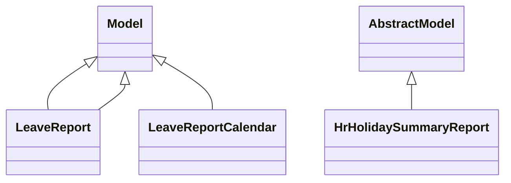

# Reports

Report definitions and templates in hr_holidays.

## Available Reports

### PDF/Document Reports
- **Time Off Summary** (PDF/Print)
- **Time Off Summary** (PDF/Print)

## Report Files

- **holidays_summary_report.py** (Python logic)
- **hr_holidays_reports.xml** (XML template/definition)
- **hr_holidays_templates.xml** (XML template/definition)
- **hr_leave_employee_type_report.py** (Python logic)
- **hr_leave_employee_type_report.xml** (XML template/definition)
- **hr_leave_report_calendar.py** (Python logic)
- **hr_leave_report_calendar.xml** (XML template/definition)
- **hr_leave_report.py** (Python logic)
- **hr_leave_reports.xml** (XML template/definition)
- **__init__.py** (Python logic)

## Notes
- Named reports above are accessible through Odoo's reporting menu
- Python files define report logic and data processing
- XML files contain report templates, definitions, and formatting
- Reports are integrated with Odoo's printing and email systems
